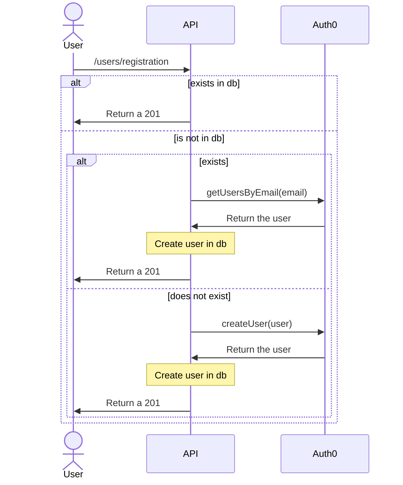
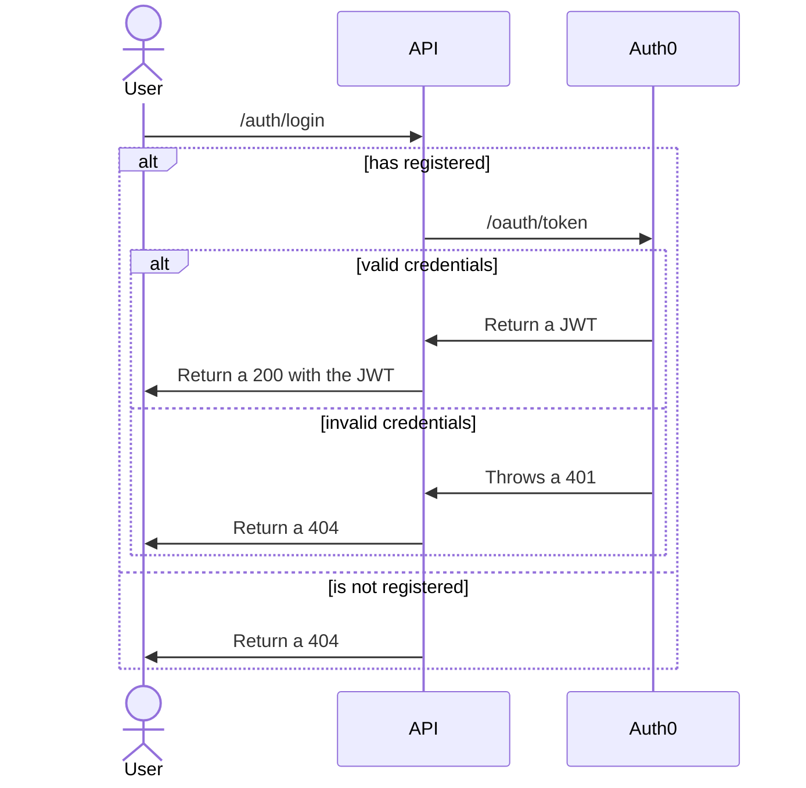

# veritas

This is an `auth0` experimental project.

## Requirements

- [x] Username / password sign-in
- [x] User registration
- [x] Social connect sign-in
- [ ] User account linking
- [ ] SAML sign-in
- [ ] WS-Fed sign-in
- [x] Terraform configuration

## Getting Started

In order to use this project the following tools are required:

- [Docker](https://www.docker.com/products/docker-desktop)
- [Terraform](https://learn.hashicorp.com/tutorials/terraform/install-cli)
- [Yarn](https://yarnpkg.com/getting-started/install)

1. Follow the instructions in the [Terraform README](./terraform/README.md) to configure the `auth0`
   infrastructure.
2. Start the application: `yarn start:dev`
3. Navigate to `http://localhost:3000` in a browser OR use the `veritas.http` file to execute REST
   calls directly to the API.

## Flows

### Username & Password

Traditional username and password authentication flow.

#### Registration

> A user registers by providing a username and password:

- Does the user already exist in the database?

  - Yes: return a 201 (to avoid user enumeration attacks)
  - No: continue with the flow

- Is the user already registered in `auth0`?

  - Yes: retrieve the `auth0_id`, and continue with the flow
  - No: create the user in `auth0`, and continue with the flow

- Create the user record in the database with the `auth0_id`

  - Should we allow a user that is registered with a social connection in `auth0` to also register
    using a username and password, and then **link** the accounts?

- Return a 201 to the user. (The user should be redirected to a login page)

#### Login

> A user logs in by providing a username and password:

- Does the user exist in the database?

  - Yes: continue with the flow
  - No: return a 404 (to avoid user enumeration attacks): "Invalid username or password"

- User's credentials are correct in `auth0`?

  - Yes: continue with the flow (returns a JWT)
  - What action should we take if a user has registered with `google-oauth`?
  - No: return a 404 (to avoid user enumeration attacks): "Invalid username or password"

- Return a 200 to the user with the JWT.

### Social Connect

Allow registration and sign-in via a `Social Network` platform, e.g. Google, Facebook, etc.

> A user registers by selecting "Continue with Google" on the registration page:

The user is authenticated in the browser, subsequently the `auth0` actions are triggered:

> pre-registration

- Does the user have multiple `identities` in `auth0`:

  - Yes:
    - `metadata.link_identities = true`
  - No:
    - `metadata.link_identities = false`

- Does the user exist in the database:

  - Yes:
    - `metadata.create_user = false`
  - No:
    - `metadata.create_user = true`

- Can the `identities` be requested directly from `auth0` in the action?
- Is there a scenario where a user exists in the database but not in `auth0`?

> post-login

- `metadata.create_user = true`:

  - Create user in the database
    - Endpoint needs to be defined

- `metadata.link_identities = true`:

  - Link user identities from the API
    - Endpoint needs to be defined

### SAML

Allow registration and sign-in via a configured SAML flow.

SAML sign-in requirements:

- SAML 2.0 standard, a generic solution that will cover more use cases and will help for specific
  SSO such as Google or Microsoft (Office / Active Directory).
- External identity provider integration (e.g. Okta, Auth0, etc.)

The implementation of SSO will allow users to create an account and log in to the console using the
identity provider they want configured for their organization. They also would like their own groups
of users to be reflected in internal roles and permissions.

## TODO

- Allow account linking when their are multiple accounts using the same email address.

- Determine what Auth0 can store, and how would we extend our Auth0 to access other Okta or Auth0
  instances of external companies.

- Create `auth0` actions

- Create admin panel using [Retool](https://retool.com/)

- What other flows are there?

- What is the database structure?

- How are the roles and permissions structured?

- Create DB schema for organizations, users (members), and roles and permissions.
